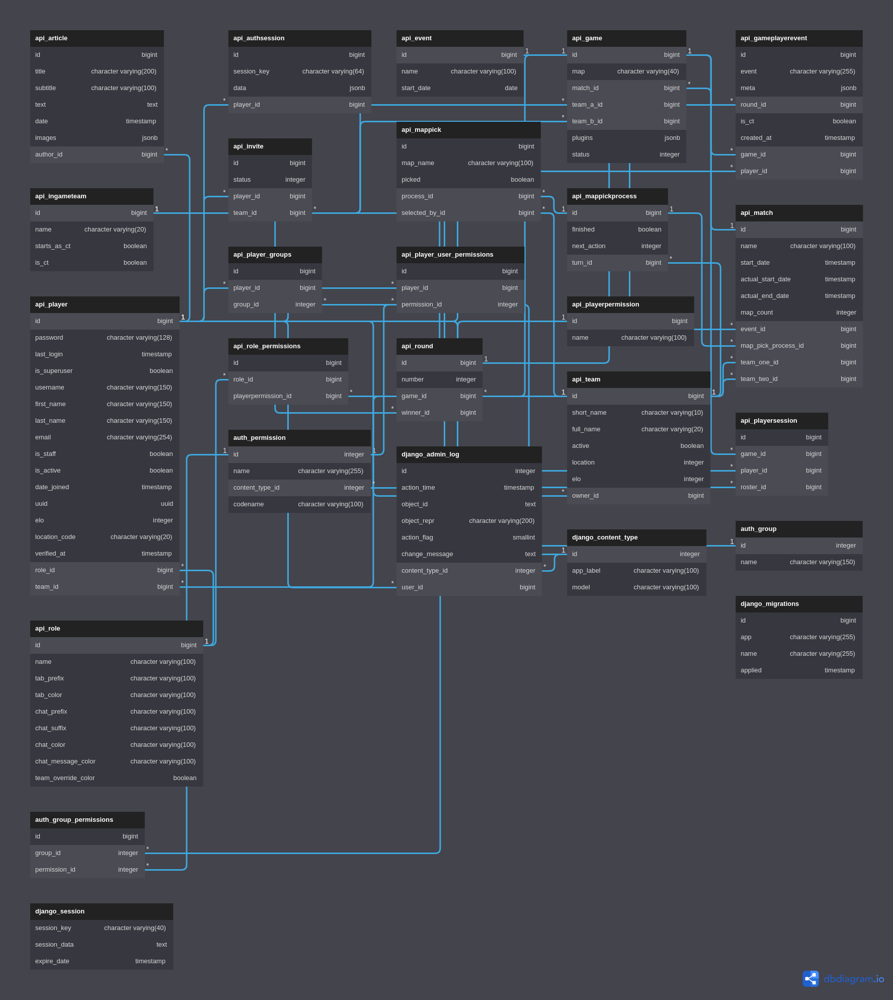

# MCTV

## Introduction

MCTV - Minecraft TV - is a website that allows you to track game statistics for 
Minestrike servers. It is written in Python and uses the Django framework as well as FastAPI and GraphQL.

## Credits

* [Django](https://www.djangoproject.com/)
* [FastAPI](https://fastapi.tiangolo.com/)
* [GraphQL](https://graphql.org/)

## Changelog

### TBD

## TODO 
  - [ ] Add a way for player to create own team
  - [ ] Add a way for a team owner to invite a player to a team
  - [ ] Add a way for a team owner to kick a player from a team
  - [ ] Add a way for a team owner to promote a player to team owner
  - [ ] Add a way for a team owner to demote a player from team owner
  - [ ] Add a way for a team owner to disband a team
  - [ ] Add a way for a player to leave a team
  - [ ] Add a way for a player to accept invite to a team
  - [ ] Add a way for a player to decline invite to a team
  - [ ] Add a way for a player to view list of games (frontend view)
  - [ ] Add a way for a player to filter games in list view
  - [ ] Add a way for a player to view game details (frontend view)
  - [ ] Add a way for a player to view list of teams (frontend view)
  - [ ] Add a way for a player to view teams details (frontend view)
  - [ ] Add a way for a player to view list of players (frontend view)
  - [ ] Add a way for a player to view player profile (frontend view)
  - [ ] Add a way for a player to view list of matches (frontend view)
  - [ ] Add a way for a player to filter matches in list view
  - [ ] Add a way for a player to view match details (frontend view)
  - [ ] Add a way for a player to view list of events (frontend view)
  - [ ] Add a way for a player to filter events in list view
  - [ ] Add a way for a player to view event details (frontend view)
  - [ ] Add main page with news
  - [ ] Add a limited view for top entities on the main page

---

